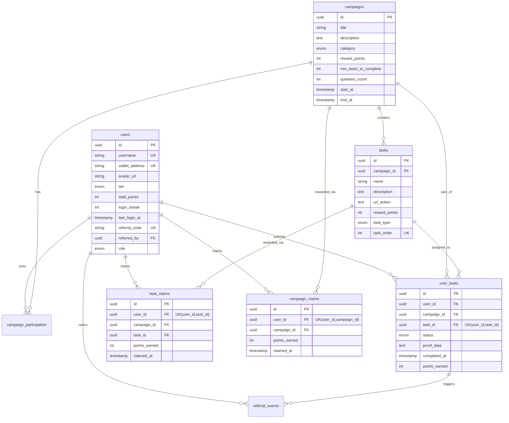
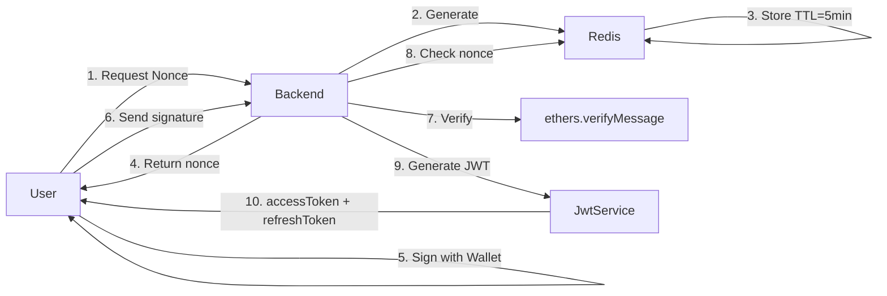
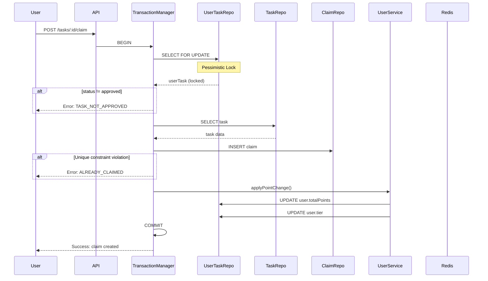
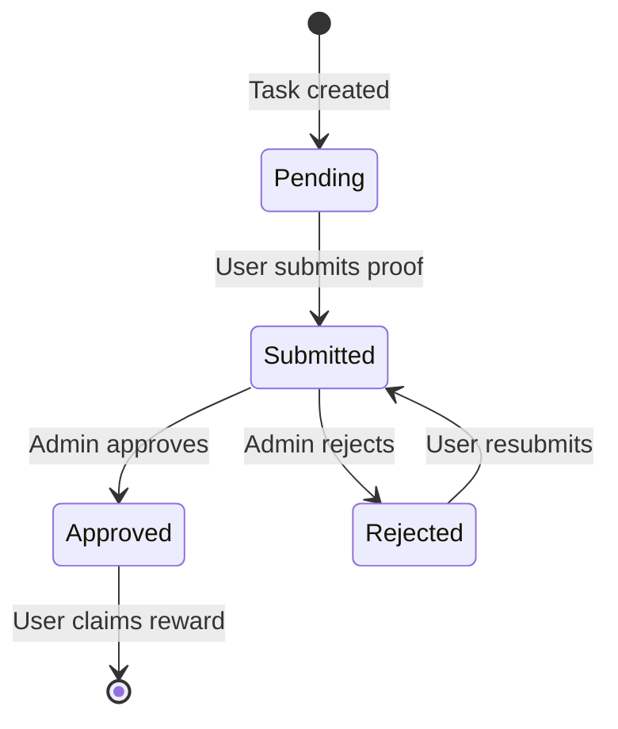
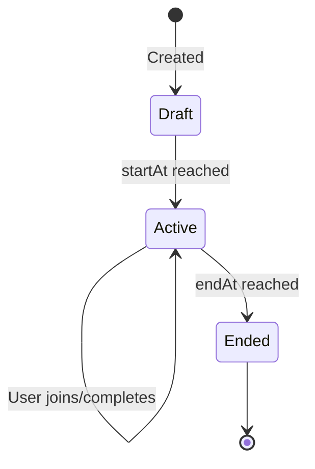

# 🏗️ Architecture Guide

## System Overview

Tasmil Finance Incentive Program is a **Web3 quest platform** built with:
- **Backend**: NestJS + TypeScript
- **Database**: PostgreSQL 16
- **Cache**: Redis 7
- **Authentication**: Wallet signature verification (ethers.js)
- **Deployment**: Docker + Docker Compose

---

## 🎯 **Core Features**

1. **Wallet Authentication** - Sign-in with Web3 wallet (no password)
2. **Campaign Management** - Admins create quests with tasks
3. **Task Submission** - Users submit proof of completion
4. **Reward System** - Point-based rewards with tier progression
5. **Referral System** - Earn points for inviting friends

---

## 🏛️ **Architecture Pattern**

### Layered Architecture

```
┌─────────────────────────────────────────┐
│         Controllers (HTTP Layer)         │
│  ┌─────────┐ ┌──────────┐ ┌──────────┐ │
│  │  Auth   │ │Campaigns │ │  Tasks   │ │
│  └─────────┘ └──────────┘ └──────────┘ │
└────────────────┬────────────────────────┘
                 │
┌────────────────▼────────────────────────┐
│        Services (Business Logic)        │
│  ┌─────────┐ ┌──────────┐ ┌──────────┐ │
│  │  Users  │ │  Claims  │ │  Admin   │ │
│  └─────────┘ └──────────┘ └──────────┘ │
└────────────────┬────────────────────────┘
                 │
┌────────────────▼────────────────────────┐
│      Repositories (Data Access)         │
│  ┌─────────┐ ┌──────────┐ ┌──────────┐ │
│  │TypeORM  │ │  Redis   │ │  Cache   │ │
│  └─────────┘ └──────────┘ └──────────┘ │
└────────────────┬────────────────────────┘
                 │
┌────────────────▼────────────────────────┐
│         Databases & Storage             │
│    ┌─────────────┐  ┌────────────┐     │
│    │ PostgreSQL  │  │   Redis    │     │
│    └─────────────┘  └────────────┘     │
└─────────────────────────────────────────┘
```

---

## 📁 **Module Structure**

### Feature Modules

```typescript
src/modules/
├── auth/               # Authentication & JWT
│   ├── auth.controller.ts
│   ├── auth.service.ts
│   ├── strategies/
│   │   └── jwt.strategy.ts
│   ├── dto/
│   └── interfaces/
│
├── users/              # User management
│   ├── users.controller.ts
│   ├── users.service.ts
│   ├── entities/
│   │   └── user.entity.ts
│   └── dto/
│
├── campaigns/          # Campaign CRUD
│   ├── campaigns.controller.ts
│   ├── campaigns.service.ts
│   ├── entities/
│   │   ├── campaign.entity.ts
│   │   └── campaign-participation.entity.ts
│   └── dto/
│
├── tasks/              # Task operations
│   ├── tasks.controller.ts
│   ├── tasks.service.ts
│   └── entities/
│       └── task.entity.ts
│
├── user-tasks/         # User task submissions
│   ├── user-tasks.service.ts
│   └── entities/
│       └── user-task.entity.ts
│
├── claims/             # Reward claiming
│   ├── claims.service.ts
│   └── entities/
│       ├── task-claim.entity.ts
│       ├── campaign-claim.entity.ts
│       └── referral-event.entity.ts
│
├── admin/              # Admin operations
│   ├── admin.controller.ts
│   └── admin.service.ts
│
├── analytics/          # Leaderboards & stats
│   ├── analytics.controller.ts
│   └── analytics.service.ts
│
└── notifications/      # User notifications
    ├── notifications.controller.ts
    └── notifications.service.ts
```

### Common Layer

```typescript
src/common/
├── decorators/         # Custom decorators
│   ├── current-user.decorator.ts
│   ├── public.decorator.ts
│   └── roles.decorator.ts
│
├── guards/            # Route guards
│   ├── jwt-auth.guard.ts
│   ├── roles.guard.ts
│   └── optional-jwt.guard.ts
│
├── filters/           # Exception handling
│   └── http-exception.filter.ts
│
├── interceptors/      # Response transformation
│   └── response.interceptor.ts
│
├── pipes/             # Input validation
│   └── parse-uuid.pipe.ts
│
├── enums/            # Type definitions
│   ├── user-role.enum.ts
│   ├── user-tier.enum.ts
│   ├── user-task-status.enum.ts
│   └── campaign-category.enum.ts
│
└── exceptions/       # Custom errors
    └── business.exception.ts
```

---

## 🗄️ **Database Schema**

### Entity Relationship Diagram



### Key Indexes

```sql
-- Users
CREATE INDEX idx_users_wallet_address ON users(wallet_address);
CREATE INDEX idx_users_total_points ON users(total_points);

-- Campaigns
CREATE INDEX idx_campaigns_category ON campaigns(category);

-- Tasks
CREATE UNIQUE INDEX idx_tasks_campaign_order ON tasks(campaign_id, task_order);

-- User Tasks
CREATE INDEX idx_user_tasks_user_id ON user_tasks(user_id);
CREATE INDEX idx_user_tasks_campaign_id ON user_tasks(campaign_id);
CREATE UNIQUE INDEX uq_user_task_user_task ON user_tasks(user_id, task_id);

-- Claims
CREATE UNIQUE INDEX uq_task_claim_user_task ON task_claims(user_id, task_id);
CREATE UNIQUE INDEX uq_campaign_claim_user_campaign ON campaign_claims(user_id, campaign_id);
```

---

## 🔐 **Security Architecture**

### Authentication Flow



### Authorization Layers

1. **Global JWT Guard** - All routes protected by default
2. **Public Decorator** - Opt-out for login/nonce endpoints  
3. **Roles Guard** - Admin-only routes (`@Roles(UserRole.Admin)`)
4. **Optional JWT Guard** - Public routes with user context

### Token Strategy

- **Access Token**: 15 minutes TTL, stored in memory
- **Refresh Token**: 7 days TTL, stored in Redis with revocation support
- **Rotation**: New tokens issued on refresh, old token revoked

---

## 💾 **Data Flow**

### Task Claim Flow (Critical Path)



---

## 🚀 **Performance Optimizations**

### Caching Strategy

```typescript
// Campaign list cache (60s TTL)
const cacheKey = `campaigns:${JSON.stringify(query)}`;

// Single campaign cache (60s TTL, user-specific queries not cached)
const cacheKey = userId ? null : `campaign:${id}`;
```

### Database Optimizations

1. **Indexes** on frequently queried columns
2. **Pessimistic locking** for critical paths (claims)
3. **Batch operations** with `Promise.all()`
4. **Query builder** for complex queries

### Redis Usage

- **Nonce storage** (5 min TTL)
- **Refresh tokens** (7 days TTL)
- **Rate limiting** (rate-limiter-flexible)
- **Cache** (NestJS cache-manager)
- **Daily login tracking** (24h TTL)

---

## 🔄 **State Machines**

### UserTask Status Transitions



### Campaign Lifecycle



---

## 🛡️ **Error Handling**

### Exception Hierarchy

```typescript
HttpException (NestJS)
  └── BusinessException (Custom)
        ├── NONCE_EXPIRED
        ├── INVALID_SIGNATURE  
        ├── TASK_NOT_APPROVED
        ├── ALREADY_CLAIMED
        └── ...
```

### Global Exception Filter

```typescript
@Catch()
export class HttpExceptionFilter {
  // Transforms all errors to:
  {
    success: false,
    data: null,
    error: {
      code: "ERROR_CODE",
      message: "Human readable message"
    }
  }
}
```

---

## 📊 **Monitoring Points**

### Critical Metrics

1. **Authentication**
   - Nonce generation rate
   - Failed signature verifications
   - Token refresh failures

2. **Business Logic**
   - Task claim success/failure rate
   - Campaign claim rate
   - Average approval time

3. **Performance**
   - Cache hit/miss ratio
   - Database query duration
   - Redis latency

4. **Errors**
   - Unique constraint violations
   - Transaction rollbacks
   - Rate limit hits

---

## 🔧 **Configuration Management**

### Config Namespaces

```typescript
config/
├── app.config.ts       # PORT, API_PREFIX, ALLOWED_ORIGINS
├── database.config.ts  # DB connection settings
├── redis.config.ts     # Redis connection
└── auth.config.ts      # JWT secrets, TTLs
```

### Environment-Based Loading

```typescript
ConfigModule.forRoot({
  isGlobal: true,
  load: [appConfig, databaseConfig, redisConfig, authConfig],
});
```

---

## 🧪 **Testing Strategy**

### Unit Tests
- Services: Mock repositories & dependencies
- Guards: Test authorization logic
- Pipes: Validate transformation

### Integration Tests
- Controllers: Test HTTP layer with mocked services
- Database: Use in-memory SQLite or test database

### E2E Tests  
- Full flow: Login → Join → Submit → Claim
- Use test database with migrations

---

## 🔗 **External Dependencies**

| Package | Purpose |
|---------|---------|
| `ethers` | Wallet signature verification |
| `typeorm` | ORM & migrations |
| `@nestjs/jwt` | JWT token handling |
| `@nestjs/passport` | Authentication strategy |
| `ioredis` | Redis client |
| `rate-limiter-flexible` | Rate limiting |
| `cache-manager` | Caching abstraction |
| `helmet` | Security headers |
| `class-validator` | DTO validation |

---

## 📖 **Further Reading**

- [API Flow Guide](./API_FLOW.md)
- [Deployment Guide](./DEPLOYMENT.md)
- [Troubleshooting](./TROUBLESHOOTING.md)
